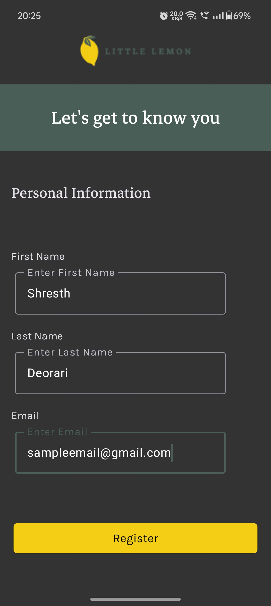
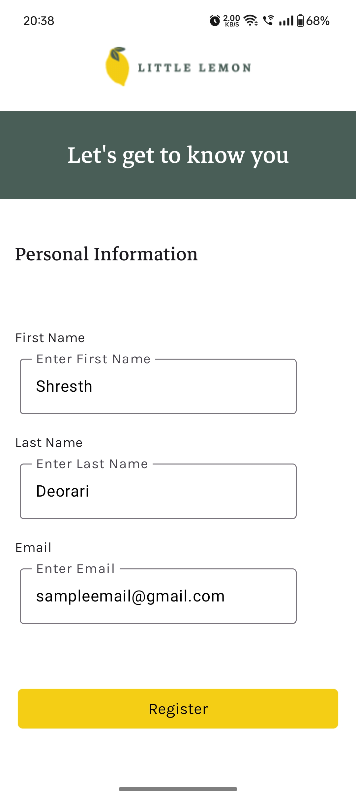
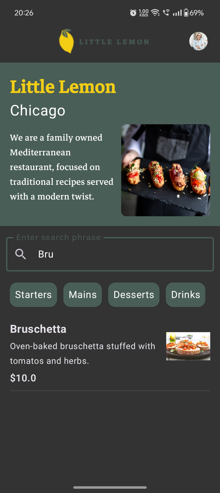
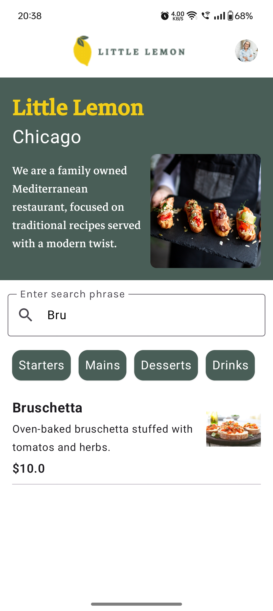
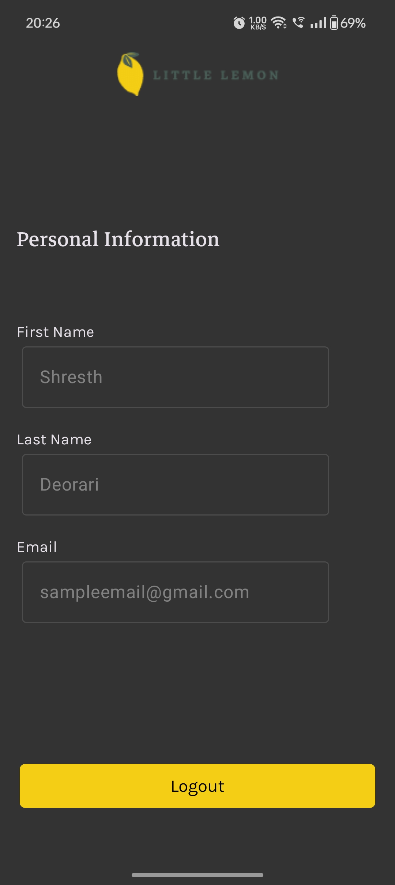
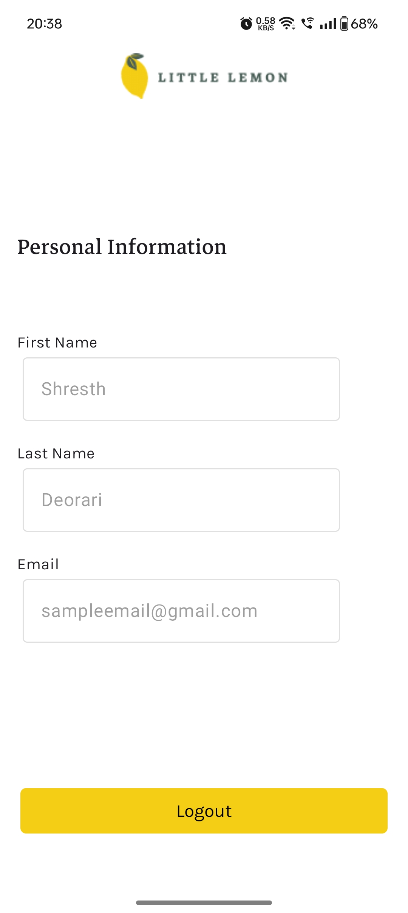

# Little Lemon App 🍋  
A modern restaurant reservation and menu management application, built as the capstone project for the **Meta Android Developer Professional Certificate**. This app demonstrates advanced Android development practices, focusing on scalability, user experience, and cutting-edge technologies like Jetpack Compose, Material3, and Room Database.  

---

##Screenshots

## 1. Login Screen

| Light Mode | Dark Mode |
|------------|-----------|
|  |  |

## 2. Home Screen

| Light Mode | Dark Mode |
|------------|-----------|
|  |  |

## 3. Profile Screen

| Light Mode | Dark Mode |
|------------|-----------|
|  |  |

## 🛠 Features  
### 🌟 Onboarding & Navigation  
- **Smooth User Flow**: Onboarding, registration, and main app navigation implemented using Jetpack Compose Navigation.  
- **Custom Back-stack Management**: Enhances user experience with seamless navigation.  

### 🎨 Material3 Components & Theming  
- **Modern UI/UX**: Designed using Material Design 3 principles with Material You components.  
- **Custom Themes**: Includes tailored typography, color palettes, and support for light/dark themes.  

### 🔒 User Authentication & Persistence  
- **Persistent Sessions**: User data securely stored using DataStore.  
- **Room Database Integration**: Ensures local data persistence and offline-first functionality.  

### 🌐 Efficient API Communication with Ktor  
- **Dynamic Updates**: HTTP requests fetch menu data and update the Room Database dynamically.  
- **JSON Parsing**: Gson used for parsing API responses into reusable data classes.  

### 🔍 Search & Sort  
- **Menu Management**: Search and filter menu items by category for an intuitive experience.  

### 🚀 Asynchronous & Lifecycle-Aware Operations  
- **Coroutines**: Used for efficient asynchronous HTTP calls to maintain a responsive UI.  
- **Lifecycle Awareness**: Ensures efficient resource usage and app performance.  

### 💡 Built Entirely with Jetpack Compose  
- **Dynamic Layouts**: Flexible and responsive UI components adhering to Material Theme guidelines.  

---

## 🚧 Challenges Faced  
1. **Ktor & Room Database**:  
   - Limited resources required additional effort to integrate these tools effectively.  
2. **Jetpack Compose Updates**:  
   - Frequent updates caused dependency conflicts, which were resolved through troubleshooting and adaptation.  
3. **Singleton Pattern**:  
   - Used for managing Ktor client and Room Database instances, reducing redundancy and promoting cleaner architecture.  

---

## 🖥 Tech Stack  
- **Languages**: Kotlin  
- **Frameworks**: Jetpack Compose, Material3  
- **Libraries**: Room, DataStore, Ktor, Gson  
- **Tools**: Android Studio  

---

## 🎯 How to Run the App  
1. Clone this repository:  
   # git clone https://github.com/yourusername/little-lemon-app.git  

2. Open the project in **Android Studio**.  

3. Build and run the app on an emulator or physical device.  
